# PDF Presenter

> Open-source PDF slide presenter with **real-time remote control** from any device.


---

## Features

| Feature           | Details                                                 |
| ----------------- | ------------------------------------------------------- |
| PDF Rendering     | Full-quality rendering via PDF.js (works offline)       |
| Remote Control    | Control slides from phone/tablet via QR code            |
| Viewer Mode       | View-only mode for audience (separate from remote)      |
| Real-time Sync    | WebSocket sync — all viewers stay in step               |
| Keyboard Nav      | Arrow keys, Space, Page Up/Down                         |
| Touch & Swipe     | Works on tablets and touch screens                      |
| Dark / Light Mode | Toggle with one click                                   |
| Multi-PDF         | Upload multiple PDFs and switch between them            |
| Fullscreen        | Distraction-free presentation mode (presenter + viewer) |
| Thumbnail Strip   | Scrub through slides quickly                            |
| Orientation       | Choose portrait/landscape for optimal viewing           |
| Offline Ready     | All vendor files bundled — no internet needed           |

---

## Video Tutorial

Watch this complete video guide to learn how to install and use PDF Presenter:

### Installation & Usage Guide


_[Video: explanation.mp4 - Complete setup and usage demonstration]_

This video covers:

- Step-by-step installation process
- How to start the application
- Remote control setup and usage
- Key features and navigation
- Tips for effective presentations

---

## Quick Start

### Automatic Installation (Recommended)

#### Linux / macOS

```bash
git clone https://github.com/AHMEDabdamine/pdf-presenter.git
cd pdf-presenter
./linux-install.sh
```

#### Windows

```batch
git clone https://github.com/AHMEDabdamine/pdf-presenter.gitr
cd pdf-presenter
windows-install.bat
```

The install scripts will:

- Check and install Node.js if needed
- Install npm dependencies (skips if already installed)
- Download offline vendor files
- Create required directories
- Launch the app automatically

### Manual Installation

#### Prerequisites

- **Node.js 16+** — [Download here](https://nodejs.org)
- Works on **Linux**, **macOS**, and **Windows**

#### 1. Clone or Download

```bash
git clone https://github.com/your-username/pdf-presenter
cd pdf-presenter
```

#### 2. Install Dependencies

```bash
npm install
```

#### 3. Start the Server

```bash
npm start
```

Server starts at **http://localhost:3000**

For development (auto-restart on changes):

```bash
npm run dev
```

---

## Using Remote Control & Viewer

### Remote Control (Phone/Tablet)

1. Open `http://localhost:3000` in your **browser** (the presenter view)
2. Upload a PDF using the drag-and-drop zone
3. Click **Remote** in the top bar
4. **Scan the QR code** with your phone, OR copy the link and open it on another device
5. Use the Prev / Next buttons on your phone to control slides in real-time

### Viewer Mode (Audience)

1. Click **Viewer** in the top bar (separate from Remote)
2. Choose **Portrait** or **Landscape** orientation based on your PDF layout
3. Scan the QR code or share the link with your audience
4. Viewers see the slides in real-time but cannot control them
5. Viewers can tap the fullscreen button to enter fullscreen mode for better viewing

> **Tip:** Use Viewer mode for audience screens, Remote mode for the presenter/assistant.

> **On your local network:** Share `http://YOUR_LOCAL_IP:3000/viewer.html?session=XXXX` for view-only access.

---

## Project Structure

```
pdf-presenter/
├── server.js              # Express + Socket.io server
├── package.json           # Dependencies
├── linux-install.sh       # Linux/macOS auto-installer
├── windows-install.bat    # Windows auto-installer
├── .gitignore             # Git ignore rules (excludes uploads/)
├── uploads/               # Auto-created; stores uploaded PDFs
└── public/
    ├── index.html         # Presenter view
    ├── viewer.html        # View-only mode for audience
    ├── remote.html        # Remote control (phone/tablet)
    ├── css/
    │   └── style.css      # All styles (dark/light themes)
    ├── js/
    │   ├── presenter.js   # PDF rendering, navigation, upload logic
    │   ├── viewer.js      # Viewer mode client
    │   └── remote.js      # Remote control WebSocket client
    └── vendor/            # Bundled libraries (offline ready)
        ├── pdf.min.js
        ├── pdf.worker.min.js
        └── qrious.min.js
```

---

## Configuration

| Environment Variable | Default | Description      |
| -------------------- | ------- | ---------------- |
| `PORT`               | `3000`  | HTTP server port |

```bash
PORT=8080 npm start
```

---

## Network / Deployment

### Local Network (same Wi-Fi)

All devices connect to the same Wi-Fi router. The laptop runs the Node.js server and hosts the presentation. Remote phones and viewers connect via HTTP/WebSocket on port 3000.



Find your machine's local IP:

- **Linux/macOS:** `ip addr` or `ifconfig`
- **Windows:** `ipconfig`

Then share: `http://192.168.x.x:3000`

### Deploying to the Cloud

The app runs on any Node.js host (Railway, Render, Fly.io, Heroku, VPS):

```bash
# Example with Railway
npm install -g railway
railway login && railway up
```

Make sure the host supports **WebSockets** (most modern PaaS do).

### Reverse Proxy (nginx)

```nginx
location / {
    proxy_pass http://localhost:3000;
    proxy_http_version 1.1;
    proxy_set_header Upgrade $http_upgrade;
    proxy_set_header Connection "upgrade";
    proxy_set_header Host $host;
}
```

---

## Keyboard Shortcuts

| Key                               | Action                        |
| --------------------------------- | ----------------------------- |
| `→` / `↓` / `Space` / `Page Down` | Next slide                    |
| `←` / `↑` / `Page Up`             | Previous slide                |
| `F`                               | Toggle fullscreen             |
| `Esc`                             | Close modal / exit fullscreen |

---

## Tech Stack

| Layer         | Technology                                                                                                          |
| ------------- | ------------------------------------------------------------------------------------------------------------------- |
| Frontend      | Vanilla HTML + CSS + JavaScript                                                                                     |
| PDF Rendering | [PDF.js](https://mozilla.github.io/pdf.js/) 3.x                                                                     |
| Backend       | [Express](https://expressjs.com/) 4.x                                                                               |
| WebSockets    | [Socket.io](https://socket.io/) 4.x                                                                                 |
| File Upload   | [Multer](https://github.com/expressjs/multer)                                                                       |
| QR Code       | [qrcode](https://github.com/soldair/node-qrcode) (server) + [QRious](https://github.com/neocotic/qrious) (fallback) |

---

## License

MIT © 2024 — Free to use, modify, and distribute.
